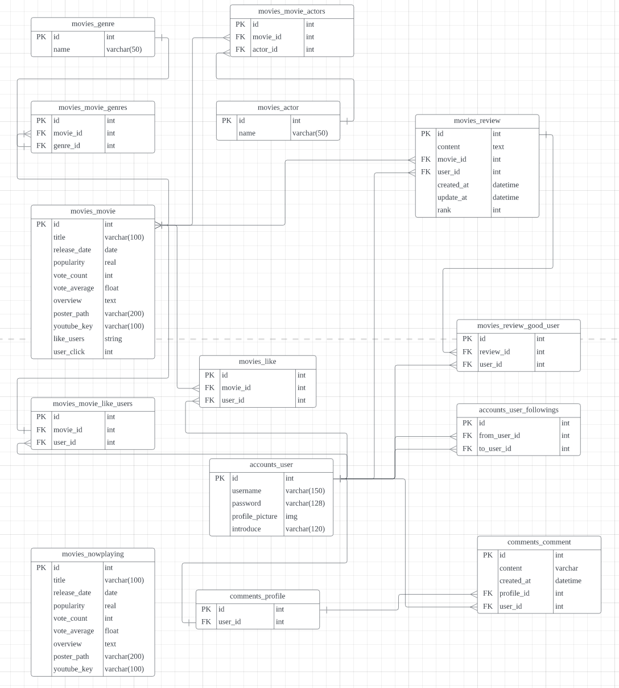
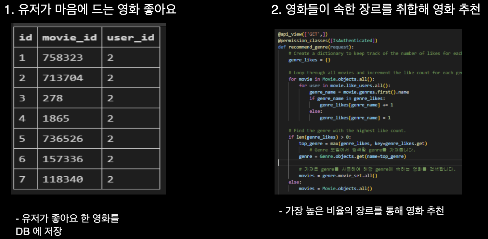

# 제목

# 0. 프로젝트 설정
- Backend
  - backend/beomflix/movies/fixtures 안에 있는 json 파일을 loaddata 합니다.
    - 필수!! 
    - actors.json, genre.json, movies.json, now_movies.json 순으로 합니다.
    > python manage.py loaddata actors.json genre.json movies.json now_movies.json 

- Frontend
  - frontend/beomflix 안에서 설정을 설치합니다.
  > npm install

  - 만약 설치가 제대로 되지 않는다면 아래의 명령어를 터미널에 입력해주세요.

  > npm install --force

# 1. **프로젝트 개요 및 팀원 업무 분담 내역**

## 1) 개발 기간

2023.05.17 ~ 2023.05.25 (총 9일)

## 2) 개발 도구

- Backend
    - Python 3.9.13
    - Django 3.2.18
    - Django REST framework 3.14.0
- Frontend
- Database
    - SQlite

## 3) 팀원 역할

### 진재환 FE

- Frontend 개발 전체

### 김윤욱 BE

- Backend 개발 전체
-  Account
    - 회원가입
    - 로그인
    - 로그아웃
    - 유저 프로필 조회
        - id로 조회
        - username으로 조회
    - 유저 프로필 수정
    - 프로필 사진 업로드, 수정
    - 프로필 자기소개 작성
    - 유저가 좋아요 한 영화 목록 조회

- Movie
    - 모든 영화 조회
    - 현재 상영중인 영화 조회
    - 영화 상세 조회
    - 영화 장르별 조회
    - 특정 영화 좋아요
    - 영화에 리뷰 작성
    - 영화 내 리뷰 조회, 수정, 삭제
    - 특정 리뷰 좋아요
    - 유저별 맞춤 영화 추천

- Community
    - 팔로우 기능
    - 유저 프로필에 방명록 작성
    - 유저 프로필에 있는 방명록 목록 조회
    - 자신의 프로필에 있는 특정 방명록 삭제

---

# 2. 목표 서비스 구현 및 실제 구현 정도
-  Account
    - 회원가입
    - 로그인
    - 로그아웃
    - 유저 프로필 조회
        - id로 조회
        - username으로 조회
    - 유저 프로필 수정
    - 프로필 사진 업로드, 수정
    - 프로필 자기소개 작성
    - 유저가 좋아요 한 영화 목록 조회

- Movie
    - 모든 영화 조회
    - 현재 상영중인 영화 조회
    - 영화 상세 조회
    - 영화 장르별 조회
    - 특정 영화 좋아요
    - 영화에 리뷰 작성
    - 영화 내 리뷰 조회, 수정, 삭제
    - 특정 리뷰 좋아요
    - 유저별 맞춤 영화 추천

- Community
    - 팔로우 기능
    - 유저 프로필에 방명록 작성
    - 유저 프로필에 있는 방명록 목록 조회
    - 자신의 프로필에 있는 특정 방명록 삭제

**API명세서를 사용해 프론트엔드와 백엔드 간의 협업 능률 향상**

[API 명세(Notion 링크)](https://www.notion.so/42465bfdbc4a4c75a1d7c8b7819d2d73?v=c345e91b8ee647a7979c0e485f5d2e97&pvs=4)

# 3. 데이터 베이스 모델링 (ERD)

# 4. 영화 추천 알고리즘

유저가 `좋아요` 한 영화들의 `장르`를 분석하여 비율이 가장 높은 `장르별 영화`를 추천

# 5. 서비스 대표 기능 및 페이지 설명

# 6. 소감
## 진재환

## 김윤욱
영화 추천 웹사이트를 만들 때 백엔드 부분을 담당하여 프로젝트를 진행했습니다. 
백엔드 개발자로서 웹사이트의 기능과 성능을 담당하는 것은 쉽지 않은 일이었습니다. 
저는 이번 프로젝트에서 많은 것을 배우고 성장했다고 말할 수 있습니다. 예를 들어, 데이터베이스 설계와 관리, RESTful API 구현과 문서화, 보안과 인증 등 다양한 주제에 대해 공부하고 적용해보았습니다. 또한, 협업 도구와 버전 관리 시스템(GIT, Github, Gitlab)을 사용하여 팀원들과 원활하게 소통하고 코드를 공유하였습니다. 이 과정에서 발생한 문제점과 이를 해결하기 위해 적극적으로 소통하고 피드백하여 프로젝트를 마무리 할 수 있었습니다. 
이렇게 하나의 웹사이트를 완성하는 데에 백엔드 개발자로서 기여할 수 있었다는 경험은 앞으로 백에드 개발자로서의 역량을 키워나가는 데 소중한 밑거름이 되었다고 생각합니다. 
이러한 소중한 경험을 통해 앞으로도 더 많은 웹사이트를 개발하고 싶다는 열정과 동기가 생겼습니다.
